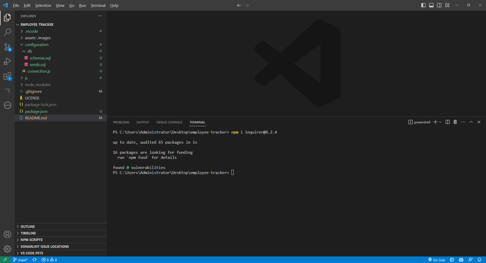
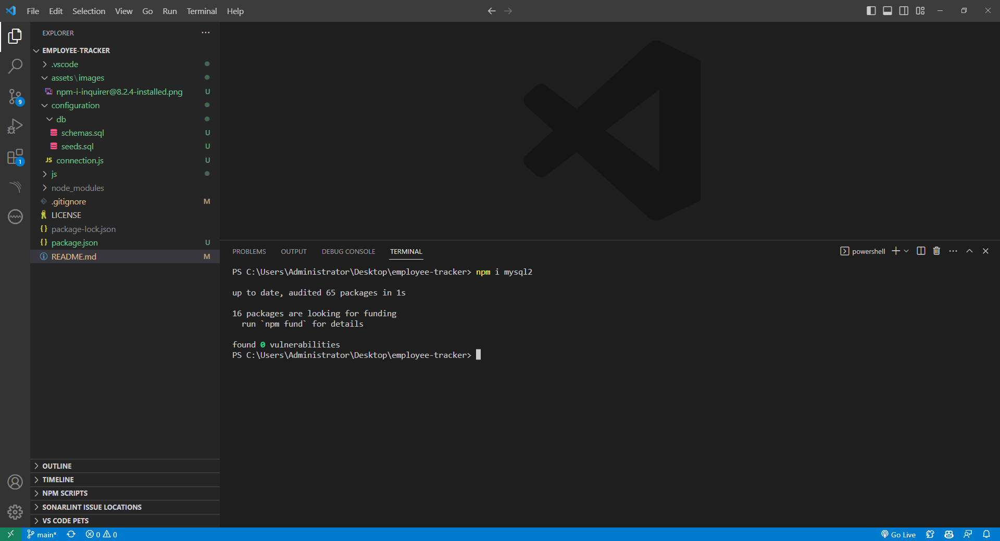
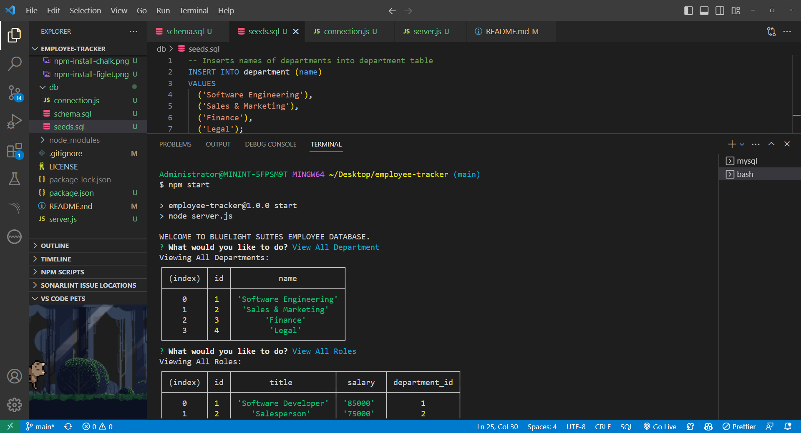
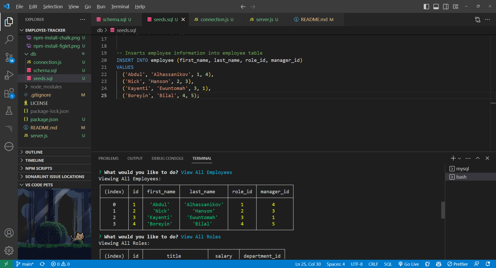
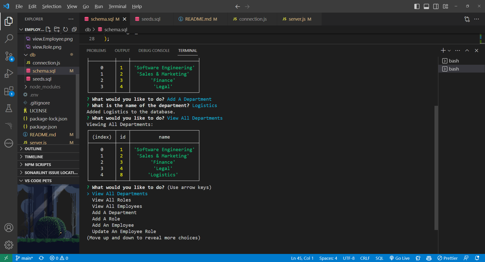
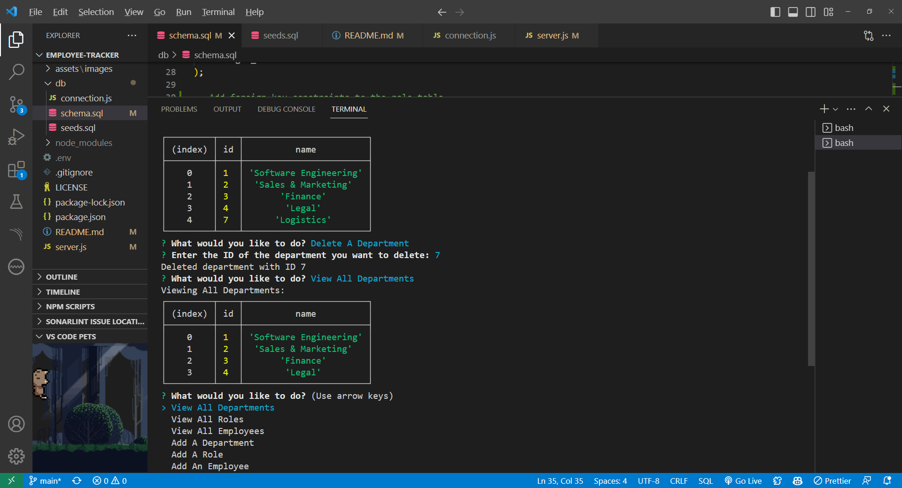
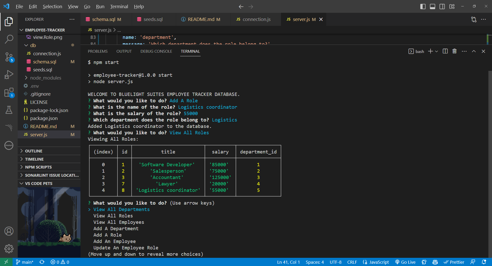
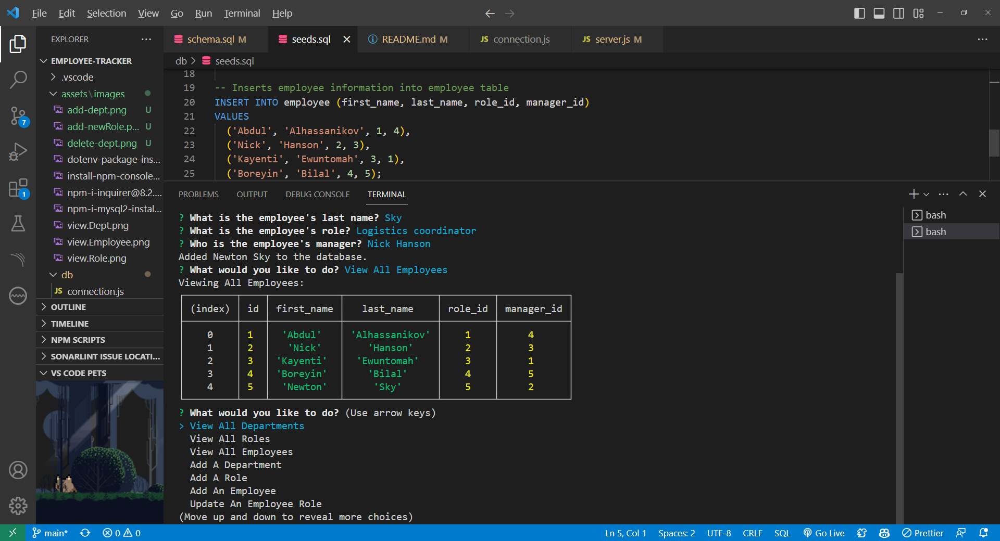

<h1 align= "center"> Employee Tracker App Using Node.js, Inquirer and MySQL👋</h1>


<p align= "center">


</p>


## Table of Contents

- [Description](#description)
- [Table of Contents](#table-of-contents)
- [Key Summary Features of this App ](#table-of-contents)
- [Installation](#installation)
- [Usage](#usage)
- [Testing](#testing)
- [Contributing](#contributing)
- [Future Enhancements](#future-enhancements)  
- [Questions](#questions)


## Description
[](https://opensource.org/licenses/MIT)

The Employee Tracker Application is a command-line tool designed to manage employee data within an organization. It offers a range of features to assist HR managers, team leaders, and employees in efficiently handling workforce-related tasks.
The Employee Tracker Application is a versatile tool that simplifies HR and employee management tasks, providing an intuitive interface for handling employee data efficiently. Its command-line interface ensures straightforward usage and allows users to manage various aspects of their workforce seamlessly.

## Key Summary Features of this App:
Below are the key functionalities and features of the Employee Tracker App:

1. **Viewing Data:**
   - **View All Departments:** Users can view a list of all departments in the organization, including their names and IDs.
   - **View All Roles:** Users can access a comprehensive list of job roles within the organization. This list includes job titles, role IDs, associated departments, and salary information.
   - **View All Employees:** Users can retrieve a detailed list of employees, providing employee IDs, first and last names, job titles, department affiliations, salaries, and the managers to whom they report.

2. **Adding Data:**
   - **Add a Department:** Users can add new departments to the organization by specifying the department's name. This is useful for expanding and restructuring departments as needed.
   - **Add a Role:** Users can create new job roles within the organization. This includes defining the role's title, salary, and assigning it to a specific department.
   - **Add an Employee:** HR managers and supervisors can easily onboard new employees by providing their first name, last name, job role, and manager. This feature helps maintain an up-to-date employee database.

3. **Updating Data:**
   - **Update an Employee's Role:** Users can modify an employee's job role, effectively handling promotions, transfers, or role changes. This feature is crucial for keeping employee records accurate.

4. **Managing Employee Hierarchy:**
   - **Update Employee Manager:** Users can update an employee's reporting manager. This ensures that the organizational structure reflects the current hierarchy.

5. **Advanced Data Retrieval:**
   - **View Employees by Manager:** Users can retrieve a list of employees who report to a specific manager, simplifying team management.
   - **View Employees by Department:** Users can filter employees by department, enabling efficient department-specific operations.

6. **Data Deletion:**
   - **Delete Departments:** Users can delete departments, which might be necessary during organizational restructuring.
   - **Delete Roles:** Unneeded job roles can be removed from the system, streamlining role management.
   - **Delete Employees:** Users can delete employee records, such as when employees leave the organization.

## Installation
***Requirments***

[Node.js](https://nodejs.org/en/) | [Inquirer](https://www.npmjs.com/package/inquirer) | [MySQL](https://www.npmjs.com/package/mysql2)

To install the Employee Tracker App, you'll need to follow these general steps:

1. **Clone or Download the Application:**
   - Clone the Repository: Open your terminal and navigate to the directory where you want to install the Employee tracker App.Then, run the following command to clone the repository: 
     ```
     git clone <git@github.com:abdulsamedtma/employee-tracker.git>
     ```
  
2. **Install Node.js and npm:**
   - Ensure that you have Node.js and npm (Node Package Manager) installed on your computer. You can download and install them from the official Node.js website: https://nodejs.org/

3. **Install Dependencies:**
   - Navigate to the application's root directory in your terminal.
   - Run the following command to install the required Node.js packages (dependencies) listed in the `package.json` file:
     ```
     npm install

     ```
     
     

4. **Set Up Database:**
   - Ensure that you have a MySQL or other compatible database server running.
   - Create the necessary database and tables as specified in the application's setup, including the `employee_db` database and relevant tables like `department`, `role`, and `employee`. You can use the SQL scripts provided or follow the application's documentation for database setup.

5. **Configuration:**
   - If the application uses environment variables for configuration (e.g., database credentials), create a `.env` file in the application's root directory and set the necessary environment variables. For example:
     ```
     DB_HOST=localhost
     DB_USER=root
     DB_PASSWORD=your_password
     DB_DATABASE=employee_db
     ```

6. **Run the Application:**
   - Start the application by running the main script (e.g., `server.js`). You can typically start it using the following command:
     ```
     node server.js
     ```
## Usage
    Start the Employee Tracker App by running node server.js in your terminal, which opens a menu with options for managing employee data.

    Use the menu to perform actions like viewing data, adding departments, roles, and employees, updating information, and deleting records.

   Follow prompts and provide required information for each action, such as entering employee details, updating roles, and selecting criteria for viewing employees. Always exercise caution when deleting records, as it's a permanent action.

## Testing
💻 Once all the packages have been installed, open terminal and run the following code in command line : 
    ```
     node server.js
    ```
    To end your server in your terminal type: control + c

## Screenshot













## Credit

N/A.

## License

NOTICE: This application is covered under the MIT License

## Permission is hereby granted, free of charge, to any person obtaining a copy

## How to Contribute

Open to collaboration, if you choose to do so open an issue and modify any changes you would like to see on a feature branch and wait for approval before merging to the main branch.
Contributions are always welcome! But please read the contribution guidelines first on [Contributor Covenant](https://www.contributor-covenant.org/).  

## Future Enhancements

I have plans to enhance the BlueLight Suites Employee Tracker application with the following features in future updates:

### 1. Update Employee Managers

- Description: Allow users to update an employee's manager, providing greater flexibility in managing the organizational hierarchy.
- Implementation: Will add a new function that prompts users to select an employee and assign a new manager to them.

### 2. View Employees by Manager

- Description: Enable users to view a list of employees managed by a specific manager.
- Implementation: Will create a function that queries the database for employees under a given manager's supervision.

### 3. View Employees by Department

- Description: Provide the ability to see a list of employees within a particular department.
- Implementation: Will implement a function that retrieves and displays employees based on their assigned department.

### 4. Calculate Total Utilized Budget

- Description: Calculate and display the total salary budget for a specific department, which is the sum of salaries for all employees in that department.
- Implementation: Will create a function that calculates the budget by summing up salaries from the 'role' table based on department.

### 5. Additional User Interface Improvements

- Description: Enhance the user interface to improve the overall user experience.
- Implementation: Will work on refining the command-line interface and adding more user-friendly features.

These planned enhancements will add more value to the application, making it an even more powerful tool for managing employee information and organizational data.

Please stay tuned for future updates and improvements!


## Questions

Have additional questions? Click the links below to reach me through my GitHub account or Email address.

[Link to Github](https://github.com/abdulsamedtma)

<a href="mailto:abdulsamedtma@gmail.com">Connect with Abdul via Email</a>

Click: <a href = "https://github.com/abdulsamedtma/employee-tracker"> Repository URL </a>

Click: <a href="https://drive.google.com/file/d/1zCyat_HBIsSN-PXqt8ckT0XQZG0EpZiu/view"> Deployed App on Github </a>

Click to watch walkthrough video: <a href = ""> Watch walkthrough video </a>

                  This Employee Tracker App was created with ❤️ by Abdul. ✨  Every day is a learning day!  ✨
